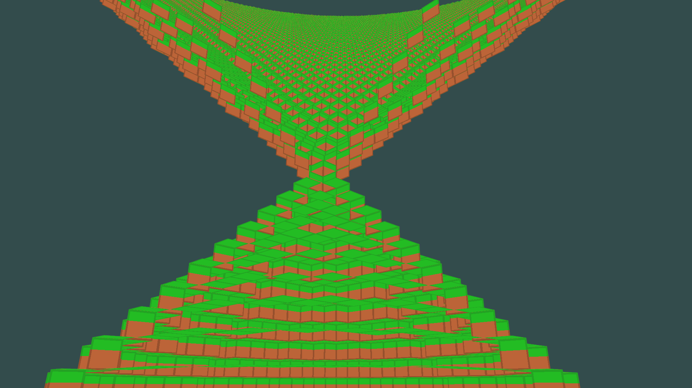
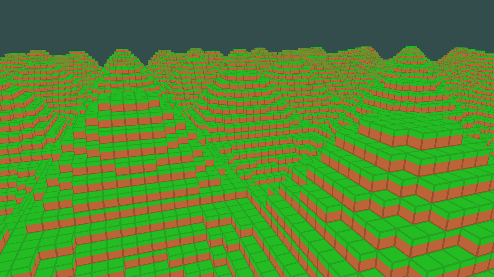

# hypercube
Minecraft clone in haskell focussed on performance.

## downloading
```shell
$ git clone https://github.com/noughtmare/hypercube.git
$ cd hypercube
```

## building
```shell
$ stack build
```
or
```shell
$ cabal sandbox init
$ cabal install --dependencies-only
$ cabal build
```

## running
```shell
$ stack exec hypercube
```
or
```shell
$ cabal run
```

## controls

```
W     - move forward
A     - move to the left
S     - move backward
D     - move to the right
SHIFT - move down
SPACE - move up
CTRL  - speed up
R     - toggle mouse cursor
ESC   - quit game
```

## screenshots






